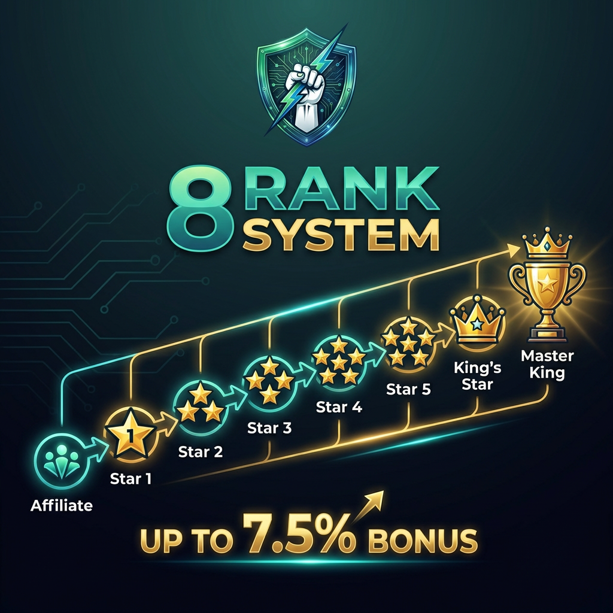

# 8-Rank Leadership Bonus System

<figure><figcaption>
Progress Through 8 Leadership Ranks - Up to 7.5% Bonus
</figcaption></figure>

Beyond the 21-level referral commissions, top leaders earn additional bonuses on their entire downline's ROI claims - up to **100 levels deep**.

## The 8 Ranks

| Rank | Bonus | Team Size | Business Volume |
|------|-------|-----------|-----------------|
| 👤 Affiliate | 0% | - | - |
| ⭐ Star 1 | +1% | 100 members | $5,000 |
| ⭐⭐ Star 2 | +2% | 200 members | $10,000 |
| ⭐⭐⭐ Star 3 | +3% | 500 members | $25,000 |
| ⭐⭐⭐⭐ Star 4 | +4% | 750 members | $50,000 |
| ⭐⭐⭐⭐⭐ Star 5 | +5% | 1,000 members | $100,000 |
| 👑 King's Star | +7% | 2,500 members | $500,000 |
| 🏆 Master King | +0.5% extra | 10 King's Stars | Network-wide |

## How It Works

### Differential Bonus

You earn the **difference** between your rank and your downline's rank on their ROI claims.

**Example:**
- You are **Star 5** (5% bonus)
- Your downline is **Star 2** (2% bonus)
- When they claim $100 ROI, you earn **3%** = $3

### 100 Levels Deep

Unlike referral commissions (21 levels), leadership bonuses extend to **100 levels** deep!

This means:
- Build deep networks
- Earn on leaders you've never met
- True passive income potential

## Rank Requirements

### Star 1 ⭐
- 100 team members total
- $5,000 cumulative business volume
- Bonus: 1% on downline ROI

### Star 2 ⭐⭐
- 200 team members total
- $10,000 cumulative business volume
- Bonus: 2% on downline ROI

### Star 3 ⭐⭐⭐
- 500 team members total
- $25,000 cumulative business volume
- Bonus: 3% on downline ROI

### Star 4 ⭐⭐⭐⭐
- 750 team members total
- $50,000 cumulative business volume
- Bonus: 4% on downline ROI

### Star 5 ⭐⭐⭐⭐⭐
- 1,000 team members total
- $100,000 cumulative business volume
- Bonus: 5% on downline ROI

### King's Star 👑
- 2,500 team members total
- $500,000 cumulative business volume
- Bonus: 7% on downline ROI

### Master King 🏆
- 10 King's Stars in your direct/indirect network
- Additional +0.5% on ALL network ROI
- Highest possible rank


**All users start as Affiliate (0%)** - you automatically progress through ranks as you build your team and meet the requirements.


## Earnings Example

You're a **King's Star** with a large network:

| Downline Rank | Their ROI Claim | Differential | Your Bonus |
|---------------|-----------------|--------------|------------|
| Affiliate (0%) | $100 | 7% | $7.00 |
| Star 2 (2%) | $100 | 5% | $5.00 |
| Star 5 (5%) | $100 | 2% | $2.00 |
| King's Star (7%) | $100 | 0% | $0 |

## Income Potential

Large networks with active members generate significant leadership income:

| Your Rank | Network Monthly ROI Claims | Your Leadership Bonus |
|-----------|---------------------------|----------------------|
| Star 3 | $50,000 | ~$1,500 |
| Star 5 | $100,000 | ~$5,000 |
| King's Star | $500,000 | ~$35,000 |
| Master King | $1,000,000 | ~$75,000 |

*Varies based on downline rank distribution*

## Tips for Advancing

1. **Focus on leaders** - Help your top people advance
2. **Go wide first** - More L1s = faster team growth
3. **Then go deep** - Support your leaders' networks
4. **Retention matters** - Active members = active volume

---

→ [Rank Requirements Detail](requirements.md)
→ [Differential Bonus Explained](differential-bonus.md)
