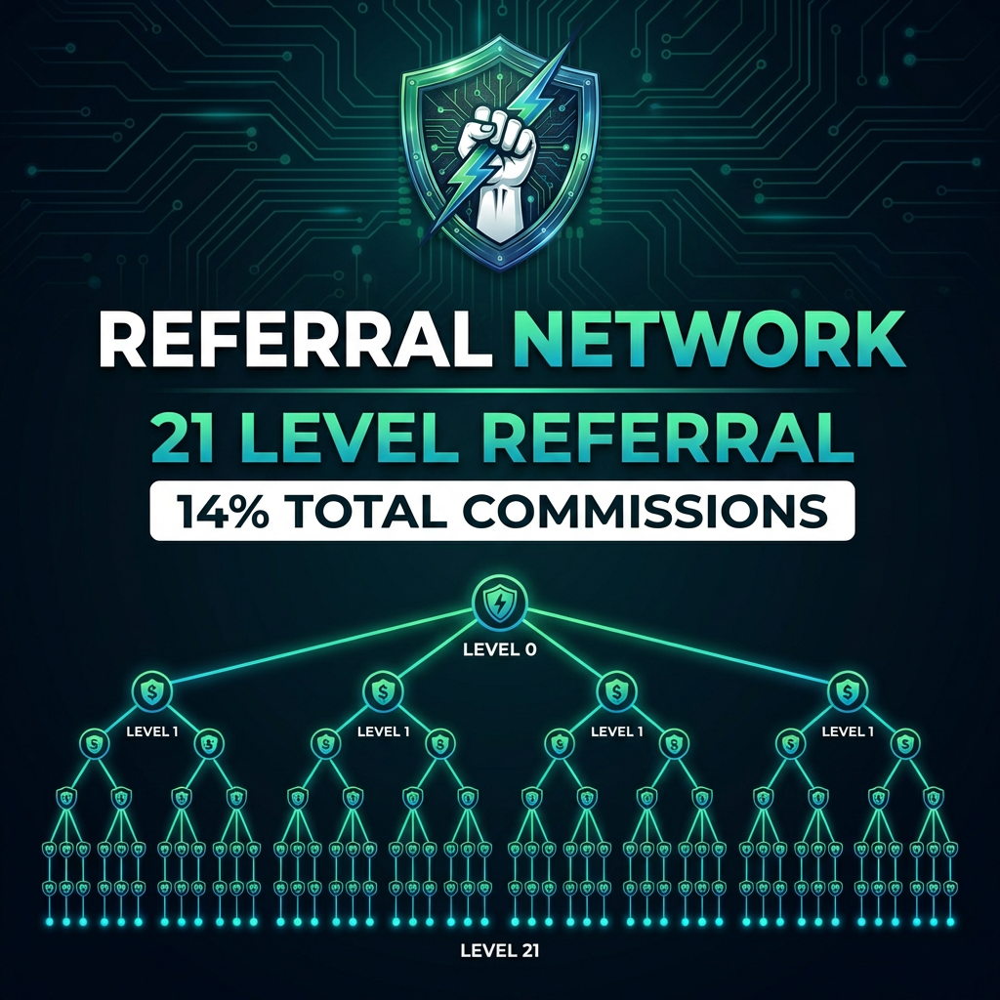

# Unlocking Levels

<figure><figcaption>
Build Your Network Across 21 Levels
</figcaption></figure>

Not all 21 referral levels are available immediately. You unlock deeper levels by increasing your deposit and building your direct team.

## Level Requirements

### Levels 1-3 (Starter)
**Unlocked by default** with any deposit.

| Requirement | Value |
|-------------|-------|
| Minimum Deposit | $10 |
| Direct Referrals | 0 |
| Commission Available | L1 (2%) + L2 (1.5%) + L3 (1.25%) = 4.75% |

### Levels 4-5
| Requirement | Value |
|-------------|-------|
| Minimum Deposit | $50 |
| Direct Referrals | 2 active |
| Commission Available | L4 (1%) + L5 (1%) = 2% |

### Levels 6-10
| Requirement | Value |
|-------------|-------|
| Minimum Deposit | $100 |
| Direct Referrals | 3 active |
| Commission Available | L6 (1%) + L7-10 (0.5% each) = 3% |

### Levels 11-15
| Requirement | Value |
|-------------|-------|
| Minimum Deposit | $100 |
| Direct Referrals | 4 active |
| Commission Available | L11-12 (0.5% each) + L13-15 (0.25% each) = 1.75% |

### Levels 16-21 (Max Depth)
| Requirement | Value |
|-------------|-------|
| Minimum Deposit | $200 |
| Direct Referrals | 5 active |
| Commission Available | L16-19 (0.25% each) + L20 (0.5%) + L21 (1%) = 2.5% |

## Summary Table

| Levels | Deposit Required | Directs Required | Total % |
|--------|-----------------|------------------|---------|
| 1-3 | $10 | 0 | 4.75% |
| 4-5 | $50 | 2 | 2% |
| 6-10 | $100 | 3 | 3% |
| 11-15 | $100 | 4 | 1.75% |
| 16-21 | $200 | 5 | 2.5% |
| **ALL** | **$200** | **5** | **14%** |

## What is an "Active" Direct?

A direct referral is considered **active** if they have:
- Made a deposit of **$50 or more** that hasn't been fully withdrawn


**Important:** Only referrals with $50+ active deposits count as "active directs" for unlocking levels. Minimum $10 deposits help them earn but don't count toward your unlock requirements.


## Unlock Strategy

### Fast Track: $200 + 5 Directs
To unlock ALL 21 levels immediately:
1. Deposit $200 or more
2. Refer 5 people who each deposit

### Budget Start: $10
Start with minimum to test:
1. Deposit $10
2. Earn from levels 1-3
3. Upgrade deposit as you grow

## Examples

### Scenario A: $50 deposit, 1 direct
- **Levels Unlocked**: 1-3
- **Missing**: Need 1 more direct for L4-5

### Scenario B: $100 deposit, 3 directs
- **Levels Unlocked**: 1-10
- **Missing**: Need 1 more direct for L11-15

### Scenario C: $200 deposit, 5 directs
- **Levels Unlocked**: ALL 21 levels
- **Status**: Maximum earning potential!

## Checking Your Status

On the dashboard, you can see:
- Your current deposit amount
- Number of active direct referrals
- Which levels are unlocked
- What's needed to unlock more

## FAQ

### Do I keep levels if my directs withdraw?
Levels are checked dynamically. If a direct withdraws and becomes inactive, your level access may reduce.

### Can I upgrade my deposit?
Yes! Make additional deposits to increase your total and unlock more levels.

### What if I'm over the requirement?
Extra deposits and directs don't hurt - they just give you buffer room.

---

→ [Commission Rates](commission-rates.md)
→ [Getting Your Referral Link](referral-link.md)
