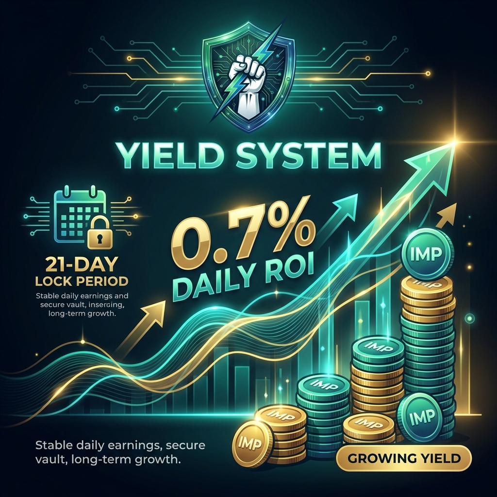

# How ROI Works

<figure><figcaption><p>Earn 0.7% Daily - 21 Day Lock Period</p></figcaption></figure>

IMP Money generates yield through automated liquidity provision. Here's the technical breakdown.

## The Source of Yield

Your returns come from **PancakeSwap V3 trading fees**, not from new deposits.

```
Trading Volume → LP Fees → IMP Vault → Your Daily ROI
```

### PancakeSwap V3 CLMM

IMP uses **Concentrated Liquidity Market Making (CLMM)**:

- Capital is deployed to USDT/USDC pairs
- Tight price range (stablecoins trade near 1:1)
- Much higher capital efficiency than traditional AMMs
- Trading fees from every swap in range

## Why 0.7% Daily?

### The Math

- USDT/USDC pool generates ~50-100% APY in fees
- Concentrated positions can achieve 100-500% APY
- 0.7% daily = 255% APY (with compounding)
- After protocol fees, 0.7% is sustainable

### Conservative Buffer

The protocol maintains reserves to ensure withdrawals during low-volume periods. Your 0.7% is designed to be consistent regardless of market conditions.

## ROI Calculation

Your earnings are calculated simply:

```
Daily Earnings = Deposit Amount × 0.7%
```

### Examples

| Deposit | Daily ROI | Weekly ROI | Monthly ROI |
|---------|-----------|------------|-------------|
| $100 | $0.70 | $4.90 | $21.00 |
| $500 | $3.50 | $24.50 | $105.00 |
| $1,000 | $7.00 | $49.00 | $210.00 |
| $5,000 | $35.00 | $245.00 | $1,050.00 |
| $10,000 | $70.00 | $490.00 | $2,100.00 |

## When ROI Starts

Your earnings begin immediately after your deposit transaction confirms:

- Block N: You deposit $1,000
- Block N+1: You start earning
- After 24 hours: ~$7.00 claimable

## Compounding Effect

If you reinvest your profits each 21-day cycle:

| Starting | After 6 Months | After 1 Year |
|----------|----------------|--------------|
| $1,000 | $2,653 | $9,450 |
| $5,000 | $13,265 | $47,250 |
| $10,000 | $26,530 | $94,500 |

*Assumes full reinvestment with no withdrawals*

## What Affects Yield

### Positive Factors
- ✅ High trading volume on PancakeSwap
- ✅ Stablecoin volatility (USDT depegs = more fees)
- ✅ More arbitrage activity

### Maintained Regardless
- Yield rate is fixed at 0.7% daily
- Protocol absorbs high/low fee periods
- Reserves ensure consistency

## Security of Your Funds

Your deposited USDT is:

1. **Held in audited smart contracts**
2. **Deployed to PancakeSwap** (blue-chip DEX)
3. **Earning real trading fees**
4. **Fully withdrawable** after 21 days

---

→ Learn more: [PancakeSwap V3 CLMM](pancakeswap-clmm.md)
